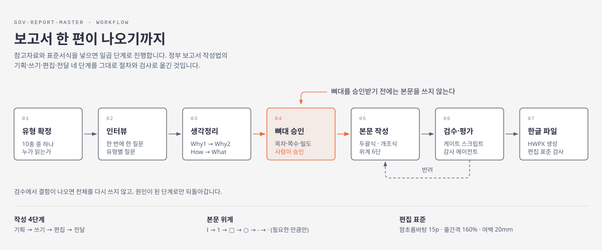

# 정부 보고서 마스터 (Gov Report Master) v1.2.0

대한민국 공무원·공공기관 실무자가 장·차관, 실·국장에게 올리는 정부 보고서를 **'고수의 보고법' 4단계(기획 → 쓰기 → 편집 → 전달)** 로 작성하고, **한글(.hwpx) 파일까지 직접 산출**하는 플러그인입니다. **클로드 코드와 코덱스(Codex CLI) 양쪽에 설치**됩니다.



## 설치

두 도구 모두 같은 저장소를 마켓플레이스로 읽습니다. 마켓플레이스 이름은 `gov-report-local` 입니다.

**클로드 코드 (Claude Code)**

```bash
claude plugin marketplace add hanimuni/gov-report-master
claude plugin install gov-report-master@gov-report-local
```

세션 안에서라면 `/plugin marketplace add hanimuni/gov-report-master` → `/plugin install gov-report-master@gov-report-local`.
설치 후 **재시작해야** 적용됩니다.

**코덱스 (Codex CLI — `codex plugin` 명령이 있는 버전. 0.147.0에서 확인)**

```bash
codex plugin marketplace add hanimuni/gov-report-master
codex plugin add gov-report-master@gov-report-local
```

코덱스에서는 `skills/` 만 로드됩니다. `agents/` 의 서브에이전트 4종은 클로드 코드 기능이라
해당 단계(서식 해부·근거 수집·검수·산출물 검사)를 본 모델이 직접 수행합니다.
게이트 스크립트와 HWPX 산출은 양쪽 모두 동일하게 동작합니다.

갱신은 `claude plugin update gov-report-master` · `codex plugin marketplace upgrade` 입니다.
실행에는 Node.js와 Python이 필요합니다 — 아래 「요구 사항」을 보세요.

## 무엇이 달라졌나 (v0.4 → v1.0)

v0.4까지는 **좋은 원고를 쓰는 스킬**이었습니다. HWPX 산출은 "존재하지 않는 외부 스킬에 넘긴다"는 문서 지침뿐이었고, 자동 검증은 0개였습니다. v1.0은 그 두 구멍을 메웁니다.

| | v0.4 | v1.0 |
|---|---|---|
| HWPX 산출 | 문서 지침만 (동작 안 함) | **kordoc 엔진 장착 · 한 줄로 생성·검증·밀도 대조** |
| 검증 | 사람이 읽는 체크리스트 | **정량 21개 · 정성 10개 · 게이트 스크립트 6종** |
| 서식 첨부 | 참고만 | **칸 구조를 해부해 기획을 앞에서 구속**(간트 4행 → 과제 4개) |
| 근거 | 없음 | **1주장 2출처 · 출처 ID가 검증 요약표로 이어짐** |
| 미흡할 때 | 사용자가 알아서 | **결함을 원인 단계로 역매핑해 그 단계만 재수행** |
| 사용자 판단 | 뼈대 승인 1회 | **게이트 7개**(G1 서식 · G2 유형 · G3 근거 · G4 스토리 · **G5 뼈대** · G6 평가 · G7 산출물) |

방법론(10종 유형·4덩어리·3대 깨포·환각 방지 3종 세트·뼈대 승인 게이팅)은 **하나도 바뀌지 않았습니다.** 그 위에 실행과 검증을 붙였습니다.

## 작동 방식 (Phase 0 ~ 7)

위 그림의 일곱 칸이 전부입니다. 자료·양식을 붙이면 **[0]자료 → [0.5]서식 해부** 가 앞에 붙고,
근거가 더 필요하면 **[2.5]근거 조사** 가 인터뷰 뒤에 끼어듭니다.

**G5(뼈대 승인)는 어떤 이유로도 우회하지 않습니다.** 승인 전에는 본문을 쓰지 않습니다.
검수에서 결함이 나오면 전체를 다시 쓰지 않고 **원인이 된 단계로만** 되돌아갑니다.

## 폴더 구조

```
gov-report-master/                저장소 루트 = 마켓플레이스 루트
├─ .claude-plugin/
│  └─ marketplace.json         name: gov-report-local · source: ./plugin
├─ README.md
├─ docs/workflow.svg           위 작동 방식 그림
└─ plugin/                     플러그인 본체 (설치되는 단위)
   ├─ .claude-plugin/plugin.json
   ├─ agents/
   │  ├─ form-analyst.md          서식 해부   (Phase 0.5)  Read·Bash·Glob·Grep
   │  ├─ source-researcher.md     근거 수집   (Phase 2.5)  WebSearch·WebFetch·Read
   │  ├─ report-auditor.md        검수·평가   (Phase 6)    Read·Grep·Glob ← 쓰기 없음
   │  └─ format-inspector.md      산출물 검사 (Phase 7)    Read·Bash·Glob·Grep
   └─ skills/gov-report-master/
      ├─ SKILL.md                 오케스트레이터 · CORE RULES 10 · 게이트 7 · 반려 루프
      ├─ references/
      │  ├─ 01~05                 기획·쓰기·편집·전달·10종 유형 상세
      │  ├─ 06-hwpx-output.md     kordoc 실행 계약 + 2025 개정 공문서 서식 규정
      │  ├─ 07-form-fidelity.md   형식 3층 · binding hard/soft · 계열 · 지면 지문
      │  ├─ 08-source-research.md 조사 강도 · 출처 등급 · 1주장 2출처
      │  └─ 09-evaluation.md      정량 21 · 정성 10 · 유형별 룰 매트릭스 · 반려 역매핑
      ├─ templates/01~10-*.md     유형별 질문세트·뼈대·깨포 + 산출 계약 1줄
      ├─ checklists/              유형별 최종 자가 점검
      ├─ profiles/
      │  ├─ 01~10-*.profile.json  계열 3종 · gate_direction · layout_signature · kordoc 인자
      │  ├─ marker-aliases.json   PDF 마커 정규화 사전
      │  └─ lint-overrides.json   kordoc 룰별 심각도 재정의
      ├─ scripts/                 normalize · analyze_form · draft_guard ·
      │                           to_kordoc_md · density_guard · evaluate · build_report
      ├─ evals/                   baseline.json(캘리브레이션) · evals.json(회귀 12건)
      └─ assets/
         ├─ samples/              실제 부처 보고서 18건 샘플카드 + INDEX
         ├─ corpus/               대표 원문 3건(기획·상황·결과) 정규화본
         └─ external/             외부 참조(MIT 2건) + ATTRIBUTION
```

## 요구 사항

- **Node.js** — HWPX 엔진 `kordoc` 를 `npx -y kordoc@^4` 로 온디맨드 실행합니다(설치 불필요, 첫 실행에 네트워크 필요).
- **Python 3.11+ 와 `lxml`** — 게이트 스크립트용. 그 외 의존성은 없습니다.

## 사용법

"정책보고서 써줘", "집중호우 상황보고", "○○사업 결과보고", "장관 말씀자료" 등으로 요청하면 발동합니다.
참고자료(과거 보고서·통계)나 **양식 파일(.hwpx)** 을 함께 붙이면 그 서식의 칸 구조에 맞춰 진행합니다.

게이트만 따로 돌려 볼 수도 있습니다.

```bash
cd plugin/skills/gov-report-master
export PYTHONUTF8=1 PYTHONIOENCODING=utf-8

python scripts/analyze_form.py 서식.hwpx -o .gov-report/01-form-profile.json
python scripts/draft_guard.py 원고.md --profile profiles/01-policy-review.profile.json --final
python scripts/evaluate.py --draft 원고.md --profile profiles/01-policy-review.profile.json \
       --auditor .gov-report/06-qa-auditor.json --qa .gov-report/06-qa.json
python scripts/build_report.py 제출용.md --type 01 -o out/보고서.hwpx \
       --org 행정안전부 --approval 담당,팀장,과장 --target-pages 5-7
```

모든 스크립트가 같은 계약을 따릅니다 — `exit 0=PASS · 1=FAIL · 2=경고 · 3=오류`, stdout은 JSON, stderr는 사람이 읽을 리포트(`--json-only` 로 억제).

> **경로 주의**: Windows에서 POSIX 절대경로(`/c/...`·`/d/...`)를 주면 Python이 읽지 못합니다. 항상 Windows 형식으로 주고 인용부호를 붙이세요.

## 설계에서 지킨 것

- **확인하지 않은 것은 통과가 아니다** — `unverifiable` 을 조용히 PASS로 넘기지 않고 별도 목록으로 냅니다.
- **점수 평균을 쓰지 않는다** — 평균은 CRITICAL을 희석합니다. 판정은 게이트입니다.
- **골든 문서는 통과 목표가 아니라 캘리브레이션 표본** — 실제 산출물조차 템플릿을 완전히 만족하지 않습니다(`evals/baseline.json`).
- **조판 프리뷰(SVG)를 만들지 않는다** — kordoc `render` 는 한컴의 실제 조판이 아니라 근사치이고, 사용자에게는 한컴오피스라는 정본이 있습니다. 쪽수는 숫자로 나오므로 그림이 필요 없습니다.
- **④ 개요정리·⑨ 말씀자료는 하한이 아니라 상한** — 밀도가 낮다고 채우면 1쪽 보고가 부풀어 오릅니다.

## 흡수한 자산 · 설치하지 않는 것

- **`Gov report pipeline-v2`** (`~/OneDrive/Desktop/`) — 서식 주도 기획(STEP 0.5)·리서치 오케스트레이션·사고 프레임워크·`StyleProfile` **필드 설계**를 이 플러그인에 흡수했습니다. 원본은 보관하되 **설치·활성화하지 않습니다** — 발동 트리거가 겹쳐(`"정책보고서"`·`"보고서 써줘"`·`"HWPX"`) 지휘가 이중이 되면 뼈대 승인 게이트가 무너집니다. 원본이 의존하던 `hwpx` 스킬은 이 환경에 없어 그대로는 실행되지 않습니다.
- **`report_blocks.py` 코드는 가져오지 않았습니다** — 미설치 스킬에 의존합니다. 필드명(`swot_slots`·`gantt_rows`·`ref_*`)만 프로파일 스키마에 채택했습니다.
- **PreToolUse 훅을 두지 않습니다** — 플레이스홀더 잔존은 `draft_guard.py` 의 Q4가 게이트에서 CRITICAL로 잡습니다. 세션 전체의 Write·Edit에 걸리는 훅은 이 워크플로우 밖에서 소음만 됩니다.
- **외부 참조 2건(MIT)** 은 `assets/external/` 에 라이선스와 함께 복사했고, 나머지는 재구현했습니다(`ATTRIBUTION.md`).

## 기관 커스터마이징

1. `templates/*.md` 를 소속 기관 표준 양식으로 교체
2. `assets/samples/` 에 우리 기관 모범 보고서 3~5건 추가(INDEX 갱신)
3. `profiles/*.profile.json` 의 `lineages` 에 우리 기관 실측값 추가
4. `SKILL.md` 끝에 `## CONTEXT`(기관·조직·결재선·약어·법령) 추가

## 방법론 출처

박종필 『고수의 보고법』, 백승권 『한번에 통과되는 기획서·보고서』, 박종덕 『2025 개정 공문서 작성법』·『실무 유형별 보고서 작성법』, 국가공무원인재개발원 보고서 작성 교안, 「행정업무운영 편람」, 국립국어원 표준. (책의 프레임워크·원칙을 실무 적용 관점에서 재구성하여 반영. 원문을 옮기지 않습니다.)

외부 참조 자산의 출처와 라이선스는 `assets/external/ATTRIBUTION.md` 에 있습니다.

## 라이선스

MIT · Author: Hani
