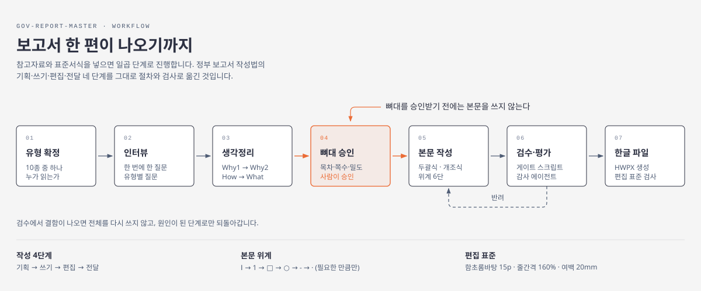

# 정부 보고서 마스터 (Gov Report Master) v1.4.0

대한민국 공무원·공공기관 실무자가 장·차관, 실·국장에게 올리는 정부 보고서를 **'고수의 보고법' 4단계(기획 → 쓰기 → 편집 → 전달)** 로 작성하고, **한글(.hwpx) 파일까지 직접 산출**하는 플러그인입니다. **클로드 코드와 코덱스(Codex CLI) 양쪽에 설치**됩니다.



## 설치

두 도구 모두 같은 저장소를 마켓플레이스로 읽습니다. 마켓플레이스 이름은 `gov-report` 입니다.

**클로드 코드 (Claude Code)**

```bash
claude plugin marketplace add hanimuni/gov-report-master
claude plugin install gov-report-master@gov-report
```

세션 안에서라면 `/plugin marketplace add hanimuni/gov-report-master` → `/plugin install gov-report-master@gov-report`.
설치 후 **재시작해야** 적용됩니다.

**코덱스 (Codex CLI — `codex plugin` 명령이 있는 버전. 0.147.0에서 확인)**

```bash
codex plugin marketplace add hanimuni/gov-report-master
codex plugin add gov-report-master@gov-report
```

코덱스에서는 `skills/` 만 로드됩니다. `agents/` 의 서브에이전트 4종은 클로드 코드 기능이라
해당 단계(서식 해부·근거 수집·검수·산출물 검사)를 본 모델이 직접 수행합니다.
게이트 스크립트와 HWPX 산출은 양쪽 모두 동일하게 동작합니다.

갱신은 `claude plugin update gov-report-master` · `codex plugin marketplace upgrade` 입니다.
실행에는 Node.js와 Python이 필요합니다 — 아래 「요구 사항」을 보세요.

## 처음 쓰는 분께 — 사용 안내

명령어를 외울 필요가 없습니다. 평소 말하듯 요청하면 플러그인이 질문을 던지며 끌고 갑니다.

### 1. 시작하기

대화창에 쓰려는 보고서를 말하면 발동합니다.

```
○○제도 개선방안 정책보고서 써줘. 실·국장 보고용이고 5쪽 안팎이야.
```

발동하지 않으면 `/gov-report-master:gov-report-master` 를 입력해 직접 부릅니다.

처음부터 함께 주면 결과가 좋아지는 것:

| 주는 것 | 왜 필요한가 |
|---|---|
| **참고자료** (과거 보고서·통계·법령·메모) | 주지 않은 수치는 지어내지 않고 빈칸으로 남깁니다. 재료가 많을수록 빈칸이 줄어듭니다 |
| **서식 파일** (`.hwpx`) | 기관 서식이 있으면 그 서식의 칸과 문단 모양에 맞춰 씁니다 |
| **보고 대상** (장관·차관·실국장·타 기관·국민) | 분량과 서술 수준이 달라집니다 |
| **분량** (1쪽·3쪽·5~7쪽·본문+붙임) | 뼈대를 짤 때 쪽 배분의 기준이 됩니다 |

### 2. 쓸 수 있는 보고서 10종

| # | 유형 | 이럴 때 | 요청 예 |
|---|---|---|---|
| ① | 정책검토 | 결정을 구할 때 | 「○○제도 개선 검토」 |
| ② | 계획수립 | 정해진 일을 집행할 때 | 「○○사업 세부추진계획」 |
| ③ | 상황 | 일이 벌어지고 있을 때 | 「집중호우 상황보고」 |
| ④ | 개요정리 | 1쪽으로 압축할 때 | 「질의답변 1쪽 자료」 |
| ⑤ | 회의참고 | 회의 안건을 검토할 때 | 「타 부서 의견 검토자료」 |
| ⑩ | 결과보고 | 일을 마쳤을 때 | 「○○대책 추진결과」 |
| ⑥ | 보고자료 | 상급기관에 낼 때 | 「업무 추진현황」 |
| ⑦ | 협의자료 | 타 기관과 협의할 때 | 「기관 간 협조 요청」 |
| ⑧ | 설명자료 | 국민·언론에 알릴 때 | 「보도자료」 |
| ⑨ | 말씀자료 | 행사에서 말할 때 | 「축사·기념사」 |

목록에 없는 문서(국정감사 답변자료 등)도 그대로 말하면 가장 가까운 유형으로 잡아 줍니다.

### 3. 대화가 흘러가는 순서

| 단계 | 플러그인이 하는 일 | 사용자가 할 일 |
|---|---|---|
| 유형·대상 확인 | 10종 중 무엇인지, 누가 읽는지 묻습니다 | 답합니다 |
| 인터뷰 | 질문을 **한 번에 하나씩** 합니다 | 아는 만큼 답합니다. 모르면 「없어」라고 하면 됩니다 |
| 생각정리 | 왜 중요한가 → 왜 생겼나 → 어떻게 풀까 → 무엇을 할까로 줄거리를 잡아 보여 줍니다 | 인과가 맞는지 봅니다 |
| **뼈대 승인** | 목차와 쪽 배분을 제안합니다 | **「좋아」「진행」이라고 해야 본문을 씁니다.** 고칠 곳이 있으면 여기서 말합니다 |
| 본문 | 전체 초안을 한 번에 씁니다 | 고칠 섹션을 짚어 말합니다 |
| 검수·최종본 | 「완성」이라고 하면 기계 검사와 검수를 거쳐 최종본을 냅니다 | 경고 목록을 보고 확정합니다 |
| 한글 파일 | 요청하면 `.hwpx` 로 만듭니다 | 한글에서 열어 확인합니다 |

목차를 먼저 승인받는 까닭은, 본문을 다 쓴 뒤 구조를 바꾸면 처음부터 다시 써야 하기 때문입니다.
급하면 「빨리 써줘」라고 하면 질문을 최소로 줄입니다. 그래도 줄거리 확인과 뼈대 승인은 거칩니다.

### 4. 결과물 읽는 법

최종본은 항상 두 벌로 나옵니다.

- **버전 A (검토용)** — `[AI]` 표시가 붙어 있습니다. 사용자가 주지 않았는데 AI가 채운 내용이 든 문단입니다.
- **버전 B (제출용)** — 표시를 뗀 깨끗한 본입니다.

함께 나오는 것:

- **`{{항목명 — 실제 데이터로 교체}}`** — 모르는 수치·법령을 지어내지 않고 남긴 빈칸입니다. 제출 전에 채워야 합니다.
- **검증 요약표** — 내용별로 사용자 제공인지 AI 생성·계산인지, 무엇으로 확인하면 되는지 적은 표입니다.

> **`[AI]` 가 붙은 수치·법령·사례는 제출 전에 반드시 직접 확인하세요.** 검증 요약표의 「확인 방법」 열이 어디를 보면 되는지 알려 줍니다.

### 5. 이렇게도 요청할 수 있습니다

| 하고 싶은 일 | 이렇게 말합니다 |
|---|---|
| 기관 서식에 맞춰 쓰기 | 서식 `.hwpx` 를 붙이고 「이 서식에 맞춰 써줘」 |
| 이미 쓴 보고서 보완 | 파일을 붙이고 「문제점마다 개선방안이 대응되는지 점검해줘」「이 내용을 반영해줘」 — 원본은 그대로 두고 별도 파일로 냅니다 |
| 설명을 더 자세히 | 「풀어서 써줘」「제3자가 읽어도 이해되게」 — 문체는 개조식 그대로 두고 설명 줄(`-`)을 늘립니다 |
| 다루는 범위 넓히기 | 「제도 전체를 다뤄줘」「연혁과 해외 사례도 넣어줘」 |
| 개정할 법령 표시 | 「개선과제마다 어느 법령·조문을 고쳐야 하는지 표시하고 신구조문 대비표를 붙여줘」 |
| 근거 보강 | 「근거를 조사해줘」 — 쟁점마다 출처 2개를 찾아 번호를 붙입니다 |
| 구두 보고 준비 | 「보고 코칭해줘」 — 대면·회의·전화 보고 요령을 줍니다 |
| 유형 바꾸기 | 「이걸 1쪽 요약으로 바꿔줘」 — 같은 내용으로 유형만 바꿉니다 |

법령 조문을 원문으로 확인하려면 법령 조회 도구(korean-law MCP)가 연결돼 있어야 합니다.
연결돼 있지 않으면 조문은 `{{ }}` 빈칸으로 남깁니다.

### 6. 한글 파일을 받은 뒤

조판은 기계가 끝까지 보장하지 못합니다. 한글에서 열어 아래를 확인하세요.

1. **쪽 넘김** — 소제목이 쪽 맨 아래에 혼자 남지 않았는가
2. **표 걸침** — 표 머리와 첫 행이 다른 쪽으로 갈리지 않았는가
3. **분량** — 목표 쪽수 안에 들어왔는가
4. **제목 상자 색** — 기관 관행과 맞는가
5. **붙임 순서** — 본문에서 언급한 순서와 번호가 같은가
6. **결재선** — 직제와 맞는가

한글에서 직접 고친 뒤 추가 수정을 맡길 때는 **고친 파일을 다시 붙여 주세요.** 그 파일에 이어서 고칩니다.

### 7. 잘 안 될 때

| 증상 | 조치 |
|---|---|
| 요청해도 플러그인이 발동하지 않는다 | 설치 후 재시작했는지 확인하고, `/gov-report-master:gov-report-master` 로 직접 부릅니다 |
| 질문 없이 바로 본문이 나온다 | 플러그인이 아니라 일반 답변입니다. 위 명령으로 다시 부릅니다 |
| 한글 파일 생성이 처음에 오래 걸리거나 실패한다 | 첫 실행 때 변환 엔진을 내려받습니다. 네트워크와 Node.js 설치를 확인합니다 |
| `lxml` 이 없다는 오류가 난다 | `pip install lxml` |
| 파일을 찾지 못한다는 오류가 난다 | 경로를 `C:\...` 형식으로 주고 따옴표로 감쌉니다 |
| 검수에서 FAIL 로 멈춘다 | 정상 동작입니다. 결함 목록과 선택지(고쳐서 다시 / 그대로 진행)를 보고 정합니다 |
| 서식과 모양이 다르게 나왔다 | 서식 `.hwpx` 를 붙였는지 확인하고 「서식 파일을 채우는 방식으로 다시 만들어줘」라고 요청합니다 |
| 내용이 얕다 | 인터뷰에서 원인을 뒷받침하는 사실·경위를 2~3개 더 주거나 참고자료를 붙입니다 |

## 무엇이 달라졌나 (v0.4 → 지금)

v0.4까지는 **좋은 원고를 쓰는 스킬**이었습니다. HWPX 산출은 "존재하지 않는 외부 스킬에 넘긴다"는 문서 지침뿐이었고, 자동 검증은 0개였습니다. v1.0이 그 두 구멍을 메웠고, 이후 내용 밀도와 조판까지 검사 범위가 늘었습니다.

| | v0.4 | 지금 (v1.4) |
|---|---|---|
| HWPX 산출 | 문서 지침만 (동작 안 함) | **kordoc 엔진 장착 · 한 줄로 생성·검증·밀도 대조** |
| 검증 | 사람이 읽는 체크리스트 | **정량 28개 · 정성 13개 · 게이트 스크립트 6종** |
| 서식 첨부 | 참고만 | **칸 구조를 해부해 기획을 앞에서 구속**(간트 4행 → 과제 4개) |
| 근거 | 없음 | **1주장 2출처 · 출처 ID가 검증 요약표로 이어짐** |
| 미흡할 때 | 사용자가 알아서 | **결함을 원인 단계로 역매핑해 그 단계만 재수행** |
| 사용자 판단 | 뼈대 승인 1회 | **게이트 7개**(G1 서식 · G2 유형 · G3 근거 · G4 스토리 · **G5 뼈대** · G6 평가 · G7 산출물) |

방법론(10종 유형·4덩어리·3대 깨포·환각 방지 3종 세트·뼈대 승인 게이팅)은 **하나도 바뀌지 않았습니다.** 그 위에 실행과 검증을 붙였습니다.

## 작동 방식 (Phase 0 ~ 7)

위 그림의 일곱 칸이 전부입니다. 자료·양식을 붙이면 **[0]자료 → [0.5]서식 해부** 가 앞에 붙고,
근거가 더 필요하면 **[2.5]근거 조사** 가 인터뷰 뒤에 끼어듭니다.

**G5(뼈대 승인)는 어떤 이유로도 우회하지 않습니다.** 승인 전에는 본문을 쓰지 않습니다.
검수에서 결함이 나오면 전체를 다시 쓰지 않고 **원인이 된 단계로만** 되돌아갑니다.

## 폴더 구조

```
gov-report-master/                저장소 루트 = 마켓플레이스 루트
├─ .claude-plugin/
│  └─ marketplace.json         name: gov-report · source: ./plugin
├─ README.md
├─ docs/workflow.svg           위 작동 방식 그림
└─ plugin/                     플러그인 본체 (설치되는 단위)
   ├─ .claude-plugin/plugin.json
   ├─ agents/
   │  ├─ form-analyst.md          서식 해부   (Phase 0.5)  Read·Bash·Glob·Grep
   │  ├─ source-researcher.md     근거 수집   (Phase 2.5)  WebSearch·WebFetch·Read
   │  ├─ report-auditor.md        검수·평가   (Phase 6)    Read·Grep·Glob ← 쓰기 없음
   │  └─ format-inspector.md      산출물 검사 (Phase 7)    Read·Bash·Glob·Grep
   └─ skills/gov-report-master/
      ├─ SKILL.md                 오케스트레이터 · CORE RULES 10 · 게이트 7 · 반려 루프
      ├─ references/
      │  ├─ 01~05                 기획·쓰기·편집·전달·10종 유형 상세
      │  ├─ 06-hwpx-output.md     kordoc 실행 계약 + 2025 개정 공문서 서식 규정
      │  ├─ 07-form-fidelity.md   형식 3층 · binding hard/soft · 계열 · 지면 지문
      │  ├─ 08-source-research.md 조사 강도 · 출처 등급 · 1주장 2출처
      │  ├─ 09-evaluation.md      정량 28 · 정성 13 · 유형별 룰 매트릭스 · 반려 역매핑
      │  ├─ 15-administrative-terminology.md  행정용어 — 비유·구어·고유어 동사 금지(Q27)
      │  └─ 16-revision-mode.md   기존 보고서 보완 — 덮어쓰기 금지 · 개정 대상 배지 · 신구조문 대비표
      ├─ templates/01~10-*.md     유형별 질문세트·뼈대·깨포 + 산출 계약 1줄
      ├─ checklists/              유형별 최종 자가 점검
      ├─ profiles/
      │  ├─ 01~10-*.profile.json  계열 3종 · gate_direction · layout_signature · kordoc 인자
      │  ├─ marker-aliases.json   PDF 마커 정규화 사전
      │  └─ lint-overrides.json   kordoc 룰별 심각도 재정의
      ├─ scripts/                 normalize · analyze_form · draft_guard ·
      │                           to_kordoc_md · density_guard · evaluate · build_report
      ├─ evals/                   baseline.json(캘리브레이션) · evals.json(회귀 21건)
      └─ assets/
         ├─ samples/              실제 부처 보고서 18건 샘플카드 + INDEX
         ├─ corpus/               대표 원문 3건(기획·상황·결과) 정규화본
         └─ external/             외부 참조(MIT 2건) + ATTRIBUTION
```

## 요구 사항

- **Node.js** — HWPX 엔진 `kordoc` 를 `npx -y kordoc@^4` 로 온디맨드 실행합니다(설치 불필요, 첫 실행에 네트워크 필요).
- **Python 3.11+ 와 `lxml`** — 게이트 스크립트용. 그 외 의존성은 없습니다.

## 검사 스크립트만 따로 돌리기

보고서 작성은 위 「사용 안내」대로 대화로 진행하면 됩니다. 아래는 이미 쓴 원고를 검사만 하거나
플러그인을 고치는 분을 위한 내용입니다.

```bash
cd plugin/skills/gov-report-master
export PYTHONUTF8=1 PYTHONIOENCODING=utf-8

python scripts/analyze_form.py 서식.hwpx -o .gov-report/01-form-profile.json
python scripts/draft_guard.py 원고.md --profile profiles/01-policy-review.profile.json --final
python scripts/evaluate.py --draft 원고.md --profile profiles/01-policy-review.profile.json \
       --auditor .gov-report/06-qa-auditor.json --qa .gov-report/06-qa.json
python scripts/build_report.py 제출용.md --type 01 -o out/보고서.hwpx \
       --org 행정안전부 --approval 담당,팀장,과장 --target-pages 5-7
```

모든 스크립트가 같은 계약을 따릅니다 — `exit 0=PASS · 1=FAIL · 2=경고 · 3=오류`, stdout은 JSON, stderr는 사람이 읽을 리포트(`--json-only` 로 억제).

> **경로 주의**: Windows에서 POSIX 절대경로(`/c/...`·`/d/...`)를 주면 Python이 읽지 못합니다. 항상 Windows 형식으로 주고 인용부호를 붙이세요.
>
> **PowerShell 주의**: 명령 뒤에 `2>&1` 을 붙이지 않습니다(정상 실행도 오류로 표시됩니다). 판정 JSON을 파일로 받을 때는 `>` 대신 `draft_guard.py … -o 결과.json` 을 씁니다.

플러그인을 고친 뒤에는 회귀 검사를 돌립니다. 변환 엔진 `kordoc` 의 버전이 올라갔을 때도 같습니다.

```bash
python plugin/skills/gov-report-master/evals/run_evals.py
```

일부 케이스는 저장소에 담지 않은 골든 원고를 읽으므로, 그 파일이 없는 환경에서는 해당 케이스가 실패로 나옵니다.

## 설계에서 지킨 것

- **확인하지 않은 것은 통과가 아니다** — `unverifiable` 을 조용히 PASS로 넘기지 않고 별도 목록으로 냅니다.
- **점수 평균을 쓰지 않는다** — 평균은 CRITICAL을 희석합니다. 판정은 게이트입니다.
- **골든 문서는 통과 목표가 아니라 캘리브레이션 표본** — 실제 산출물조차 템플릿을 완전히 만족하지 않습니다(`evals/baseline.json`).
- **조판 프리뷰(SVG)를 만들지 않는다** — kordoc `render` 는 한컴의 실제 조판이 아니라 근사치이고, 사용자에게는 한컴오피스라는 정본이 있습니다. 쪽수는 숫자로 나오므로 그림이 필요 없습니다.
- **④ 개요정리·⑨ 말씀자료는 하한이 아니라 상한** — 밀도가 낮다고 채우면 1쪽 보고가 부풀어 오릅니다.

## 흡수한 자산 · 설치하지 않는 것

- **`Gov report pipeline-v2`** (`~/OneDrive/Desktop/`) — 서식 주도 기획(STEP 0.5)·리서치 오케스트레이션·사고 프레임워크·`StyleProfile` **필드 설계**를 이 플러그인에 흡수했습니다. 원본은 보관하되 **설치·활성화하지 않습니다** — 발동 트리거가 겹쳐(`"정책보고서"`·`"보고서 써줘"`·`"HWPX"`) 지휘가 이중이 되면 뼈대 승인 게이트가 무너집니다. 원본이 의존하던 `hwpx` 스킬은 이 환경에 없어 그대로는 실행되지 않습니다.
- **`report_blocks.py` 코드는 가져오지 않았습니다** — 미설치 스킬에 의존합니다. 필드명(`swot_slots`·`gantt_rows`·`ref_*`)만 프로파일 스키마에 채택했습니다.
- **PreToolUse 훅을 두지 않습니다** — 플레이스홀더 잔존은 `draft_guard.py` 의 Q4가 게이트에서 CRITICAL로 잡습니다. 세션 전체의 Write·Edit에 걸리는 훅은 이 워크플로우 밖에서 소음만 됩니다.
- **외부 참조 2건(MIT)** 은 `assets/external/` 에 라이선스와 함께 복사했고, 나머지는 재구현했습니다(`ATTRIBUTION.md`).

## 기관 커스터마이징

1. `templates/*.md` 를 소속 기관 표준 양식으로 교체
2. `assets/samples/` 에 우리 기관 모범 보고서 3~5건 추가(INDEX 갱신)
3. `profiles/*.profile.json` 의 `lineages` 에 우리 기관 실측값 추가
4. `SKILL.md` 끝에 `## CONTEXT`(기관·조직·결재선·약어·법령) 추가

외부 참조 자산의 출처와 라이선스는 `assets/external/ATTRIBUTION.md` 에 있습니다.

## 라이선스

MIT · Author: Hani
